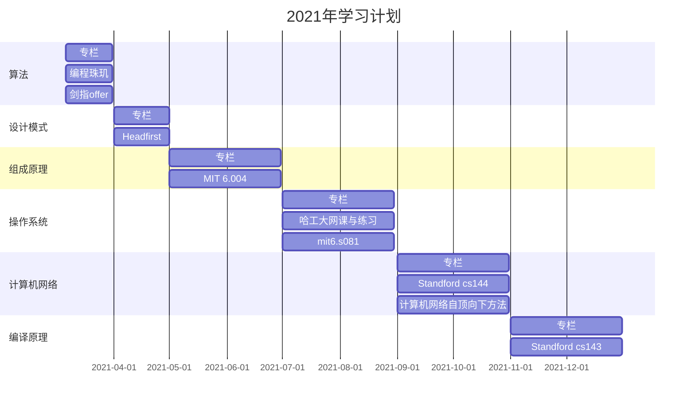

```mermaid
gantt
title 2021年学习计划
dateFormat YYYY-MM-DD
section 算法
专栏: 2021-03-06, 25d
编程珠玑: 2021-03-06, 25d
剑指offer: 2021-03-06, 25d
section 设计模式
专栏: 2021-04-01, 30d
Headfirst: 2021-04-01, 30d
section 组成原理
专栏: 2021-05-01, 60d
MIT 6.004: 2021-05-01, 60d
section 操作系统
专栏:2021-07-01, 60d
哈工大网课与练习: 2021-07-01, 60d
mit6.s081: 2021-07-01, 60d
section 计算机网络
专栏: 2021-09-01, 60d
Standford cs144: 2021-09-01, 60d
计算机网络自顶向下方法: 2021-09-01, 60d
section 编译原理
专栏: 2021-11-01, 60d
Standford cs143: 2021-11-01, 60d
```

