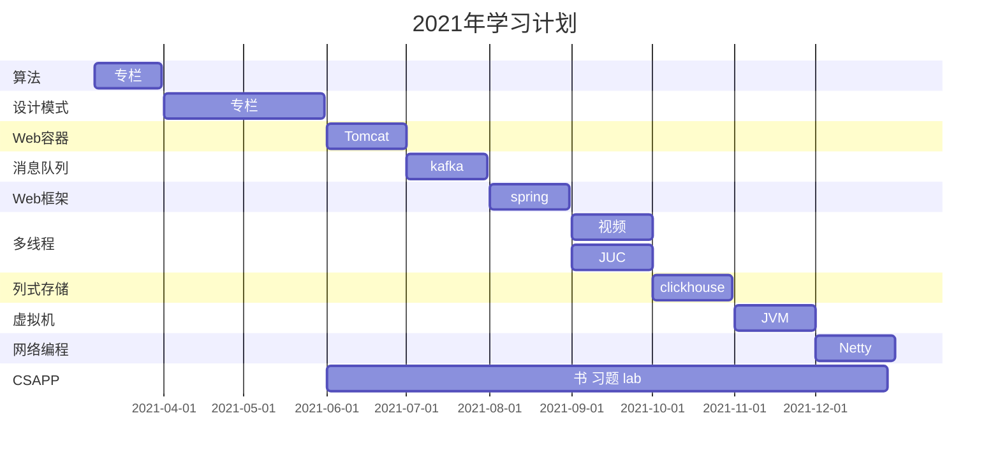

```mermaid
gantt
title 2021年学习计划
dateFormat YYYY-MM-DD
section 算法
专栏: 2021-03-06, 25d
section 设计模式
专栏: 2021-04-01, 60d
section Web容器
Tomcat: 2021-06-01, 30d
section 消息队列
kafka: 2021-07-01, 30d
section Web框架
spring: 2021-08-01, 30d
section 多线程
视频: 2021-09-01, 30d
JUC: 2021-09-01, 30d
section 列式存储
clickhouse: 2021-10-01, 30d
section 虚拟机
JVM: 2021-11-01, 30d
section 网络编程
Netty: 2021-12-01, 30d
section CSAPP
书 习题 lab: 2021-06-01, 210d
```

