# Markdown基础

[TOC]

> 生成目录：[TOC]


## 标题

```markdown
# 标题名字（井号的个数代表标题的级数）
```

# 一级标题使用1个#

## 二级标题使用2个#

### 三级标题使用3个#

#### 四级标题使4用个#

##### 五级标题使用5个#

###### 六级标题使用6个#

####### 最多支持六级标题#


## 文字

### 删除线

```markdown
这就是 ~~删除线~~ (使用波浪号)
```

这就是 ~~删除线~~ (使用波浪号)

### 斜体

```markdown
这是用来 *斜体* 的 _文本_
```

这是用来 *斜体* 的 _文本_

### 加粗

```markdown
这是用来 **加粗** 的 __文本__
```

这是用来 **加粗** 的 __文本__

### 斜体+加粗

```markdown
这是用来 ***斜体+加粗*** 的 ___文本___
```

这是用来 ***斜体+加粗*** 的 ___文本___

### 下划线


下划线是HTML语法

`下划线` <u>下划线</u>

### 高亮（需在Typora偏好设置中勾选扩展语法）

```markdown
这是用来 ==斜体+加粗== 的文本
```

这是用来 ==斜体+加粗== 的文本

### 下标（需勾选扩展语法）

```markdown
水 H~2~O 
双氧水 H~2~O~2~ 
```

水 H~2~O 

双氧水 H~2~O~2~

### 上标（需勾选扩展语法）

```markdown
面积 m^2^ 
体积 m^3^
```

面积 m^2^ 
体积 m^3^


### 表格

输入`|空格|空格|`就可以生成一个两列的表格（空格数对应列数）

使用 `|` 来分隔不同的单元格，使用 `-` 来分隔表头和其他行：

```markdown
name | price
--- | ---
fried chicken | 19
cola|5
```

> 为了使 Markdown 更清晰，`|` 和 `-` 两侧需要至少有一个空格（最左侧和最右侧的 `|` 外就不需要了）。

| name          | price |
| ------------- | ----- |
| fried chicken | 19    |
| cola          | 5     |

为了美观，可以使用空格对齐不同行的单元格，并在左右两侧都使用 `|` 来标记单元格边界，在表头下方的分隔线标记中加入 `:`，即可标记下方单元格内容的对齐方式：

```markdown
|    name       | price |
| :------------ | :---: |
| fried chicken | 19    |
| cola          |  32   |
```

| name          | price |
| :------------ | :---: |
| fried chicken |  19   |
| cola          |  32   |

使用快捷键更方便(段落→表格→插入表格，即可查看快捷键)


## 引用

```markdown
> “后悔创业”
```

> “后悔创业”

```markdown
> 也可以在引用中
>> 使用嵌套的引用
```

>也可以在引用中
>
>>使用嵌套的引用


## 列表

### 无序列表--符号 空格

```markdown
* 可以使用 `*` 作为标记
+ 也可以使用 `+`
- 或者 `-`
```


* 可以使用 `*` 作为标记

+ 也可以使用 `+`

- 或者 `-`


### 有序列表--数字 `.` 空格

```markdown
1. 有序列表以数字和 `.` 开始；
3. 数字的序列并不会影响生成的列表序列；
4. 但仍然推荐按照自然顺序（1.2.3...）编写。
```

1. 有序列表以数字和 `.` 开始；

2. 数字的序列并不会影响生成的列表序列；

3. 但仍然推荐按照自然顺序（1.2.3...）编写。

   ```markdown
   可以使用：数字\. 来取消显示为列表（用反斜杠进行转义）
   ```


### 任务列表--`-空格[空格]空格`  推荐使用快捷键

```markdown
- [ ] 任务1
- [ ] 任务2
- [ ] 任务3
```

- [ ] 任务1
- [ ] 任务2
- [ ] 任务3


## 代码

### 代码块

```markdown
​```语言名称
```

```java
 public static void main(String[] args) {
    }
```

### 行内代码

```markdown
可以通过 ``，插入行内代码（` 是 `Tab` 键上边、数字 `1` 键左侧的那个按键）：

例如 `Markdown`
```

`Markdown`


## 公式

### 公式块

输入`$$回车` 进入公式编辑

```markdown
$$
\int_0^1{e^{x}}dx
$$
```


$$
\int_0^1{e^{x}}dx
$$

### 行内公式

```markdown
$e^x$
```

$e^x$

[常用的公式符号](https://blog.csdn.net/mingzhuo_126/article/details/82722455)


## 分隔线

可以在一行中使用三个或更多的 `*`、`-` 或 `_` 来添加分隔线（``）：

```markdown
***
------
___
```

***

------

_____

## 跳转

### 外部跳转--超链接

格式为 `[link text](link)`。

```markdown
[帮助文档](https://support.typora.io/Links/#faq)
```

[帮助文档](https://support.typora.io/Links/#faq)


### 自定义快捷键

[官方教程](https://support.typora.io/Shortcut-Keys/#change-shortcut-keys)

Windows下：

1. 偏好设置--->往下拉有一个 打开高级设置 ，点击--->看到两个json格式的文件，打开第二个（conf.user.json）, 用记事本打开
2. 第17行“keyBinding”,在大括号中写 "代码块"：“你要设置的快捷键”，比如“代码块”:"Ctrl+Alt+P",保存文件，重启typora即可生效。


## 图片

```markdown

```

### 网上的图片

```markdown

```


### 本地图片

```markdown

在同一个文件夹里（用相对路径）
或者直接拷贝
```


## 画图（需勾选扩展语法）

markdown画图也是轻量级的，功能并不全。

Mermaid 是一个用于画流程图、状态图、时序图、甘特图的库，使用 JS 进行本地渲染，广泛集成于许多 Markdown 编辑器中。Mermaid 作为一个使用 JS 渲染的库，生成的不是一个“图片”，而是一段 HTML 代码。

（不同的编辑器渲染的可能不一样）

[官方教程](https://mermaid-js.github.io/mermaid/#/)

### 流程图(graph)

#### 概述

```markdown
graph 方向描述
    图表中的其他语句...
```

关键字graph表示一个流程图的开始，同时需要指定该图的方向。

其中“方向描述”为：

| 用词 | 含义     |
| :--- | :------- |
| TB   | 从上到下 |
| BT   | 从下到上 |
| RL   | 从右到左 |
| LR   | 从左到右 |

> T = TOP，B = BOTTOM，L = LEFT，R = RIGHT，D = DOWN

最常用的布局方向是TB、LR。

```markdown
graph TB;
  A-->B
  B-->C
  C-->A
```

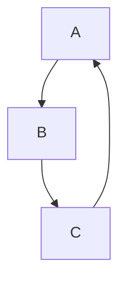


```markdown
graph LR;
  A-->B
  B-->C
  C-->A
```


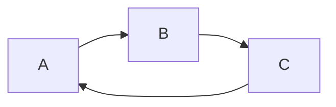

#### 流程图常用符号及含义

##### 节点形状

| 表述       | 说明         | 含义                                                 |
| :--------- | :----------- | ---------------------------------------------------- |
| id[文字]   | 矩形节点     | 表示过程，也就是整个流程中的一个环节                 |
| id(文字)   | 圆角矩形节点 | 表示开始和结束                                       |
| id((文字)) | 圆形节点     | 表示连接。为避免流程过长或有交叉，可将流程切开。成对 |
| id{文字}   | 菱形节点     | 表示判断、决策                                       |

**单向箭头线段**：表示流程进行方向

>id即为节点的唯一标识，A~F 是当前节点名字，类似于变量名，画图时便于引用
>
>括号内是节点中要显示的文字，默认节点的名字和显示的文字都为A


```markdown
graph TB
  A
  B(圆角矩形节点)
  C[矩形节点]
  D((圆形节点))
  E{菱形节点}
```

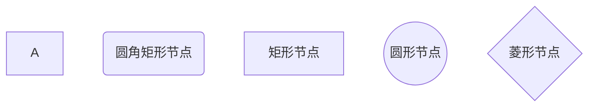


``` markdown
graph TB
    begin(出门)--> buy[买炸鸡]
    buy --> IsRemaining{还有没有炸鸡？}
    IsRemaining --有-->happy[买完炸鸡开心]--> goBack(回家)
    IsRemaining --没有--> sad[伤心]--> goBack
    
```

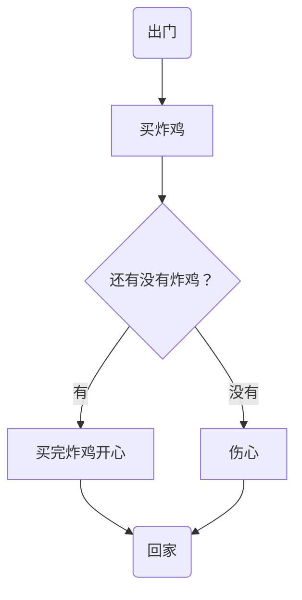


##### 连线

```markdown
graph TB
  A1-->B1
  A2---B2
  A3--text---B3
  A4--text-->B4
  A5-.-B5
  A6-.->B6
  A7-.text.-B7
  A8-.text.->B8
  A9===B9
  A10==>B10
  A11==text===B11
  A12==text==>B12
```

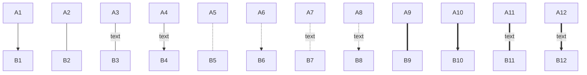

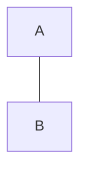


##### 子图表

使用以下语法添加子图表

```markdown
subgraph 子图表名称
    子图表中的描述语句...
end
```

```markdown
graph TB
	  subgraph 买炸鸡前
   			 begin(出门)--> buy[出门买炸鸡]
    end
    buy --> IsRemaining{"还有没有炸鸡？"}
    IsRemaining --没有--> sad["伤心"]--> goBack(回家)
    IsRemaining -->|有|happy[买完炸鸡开心]--> goBack
```

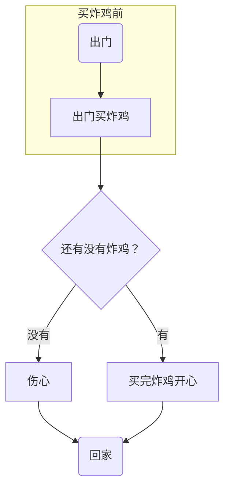

### 序列图(sequence diagram)

#### 概述

```markdown
sequenceDiagram 
	[参与者1][消息线][参与者2]:消息体
    ...
```

>`sequenceDiagram` 为每幅时序图的固定开头

```markdown
sequenceDiagram
		Title: 买炸鸡
    我->>炸鸡店小哥: 还有炸鸡吗？
    炸鸡店小哥-->>我: 没有，要现炸
```


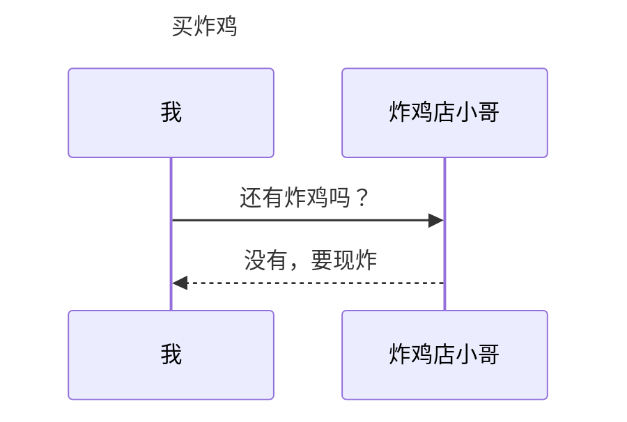

#### 参与者（participant）

传统时序图概念中参与者有角色和类对象之分，但这里我们不做此区分，用参与者表示一切参与交互的事物，可以是人、类对象、系统等形式。中间竖直的线段从上至下表示时间的流逝。

```markdown
sequenceDiagram
    participant 参与者 1
    participant 参与者 2
    ...
    participant 简称 as 参与者 3 #该语法可以在接下来的描述中使用简称来代替参与者 3
```

>`participant <参与者名称>` 声明参与者，语句次序即为参与者横向排列次序。

#### 消息线

| 类型 | 描述                         |
| :--- | :--------------------------- |
| ->   | 无箭头的实线                 |
| -->  | 无箭头的虚线                 |
| ->>  | 有箭头的实线（主动发出消息） |
| –->> | 有箭头的虚线（响应）         |
| -x   | 末端为叉的实线（表示异步）   |
| --x  | 末端为叉的虚线（表示异步）   |

#### 处理中-激活框

从消息接收方的时间线上标记一小段时间，表示对消息进行处理的时间间隔。

在消息线末尾增加 `+` ，则消息接收者进入当前消息的“处理中”状态；
在消息线末尾增加 `-` ，则消息接收者离开当前消息的“处理中”状态。

```markdown
sequenceDiagram
    participant me as 我
    participant seller as 炸鸡店小哥
    me ->> seller: 还有炸鸡吗？
    seller -->> me: 没有，要现炸。
    me -x +seller:给我炸！
    seller -->> -me: 您的炸鸡好了！
```

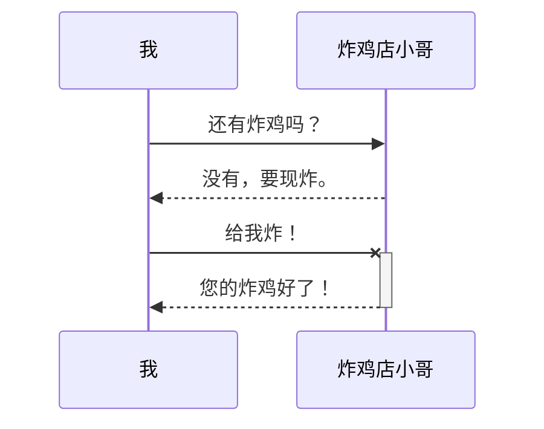

#### 注解（note）

语法如下

```markdown
Note 位置表述 参与者: 标注文字
```

其中位置表述可以为

| 表述     | 含义                       |
| :------- | :------------------------- |
| right of | 右侧                       |
| left of  | 左侧                       |
| over     | 在当中，可以横跨多个参与者 |

```markdown
sequenceDiagram
    participant me as 我
    participant seller as 炸鸡店小哥
    Note over me,seller : 热爱炸鸡
    Note left of me : 消费者
    Note right of seller : 生产者
    me ->> seller: 还有炸鸡吗？
    seller -->> me: 没有，要现炸。
    me -x +seller : 给我炸！
    seller -->> -me: 您的炸鸡好了！
```

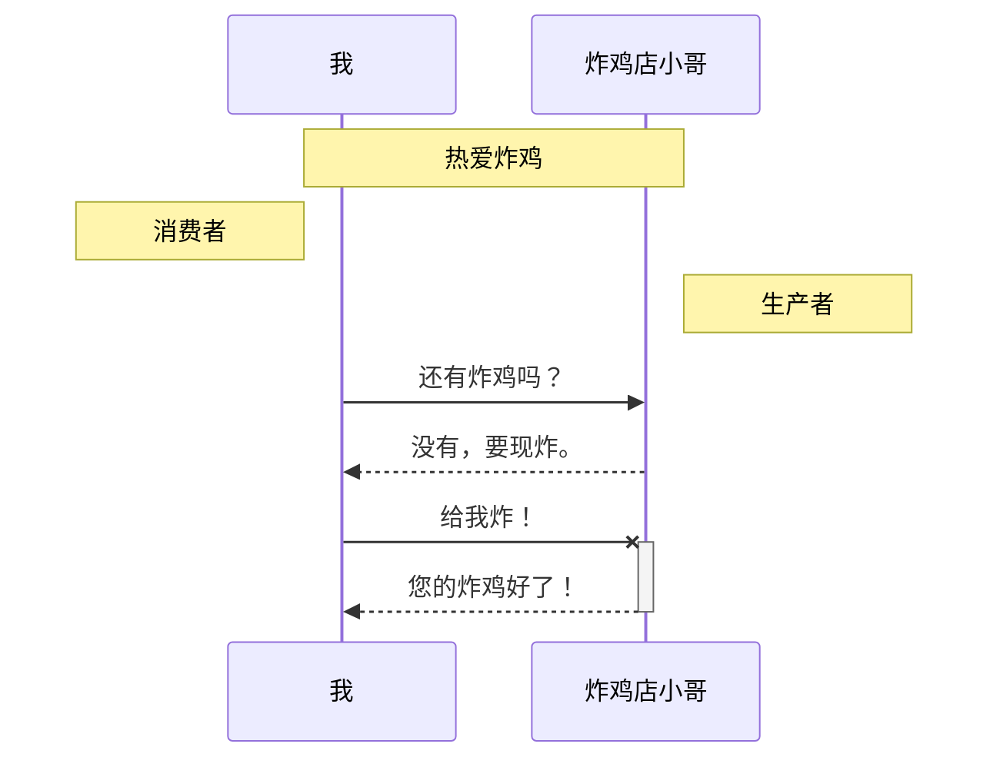

#### 循环（loop）

在条件满足时，重复发出消息序列。（相当于编程语言中的 while 语句。）

```markdown
sequenceDiagram
    participant me as 我
    participant seller as 炸鸡店小哥
   
    me ->> seller: 还有炸鸡吗？
    seller -->> me: 没有，要现炸。
    me ->> +seller:给我炸！
    loop 三分钟一次
        me ->> seller : 我的炸鸡好了吗？
        seller -->> me : 正在炸
    end
    seller -->> -me: 您的炸鸡好了！
```


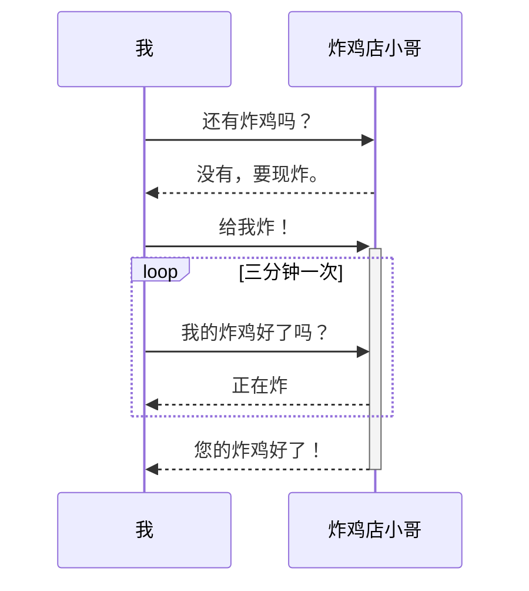

#### 选择（alt）

在多个条件中作出判断，每个条件将对应不同的消息序列。（相当于 if 及 else if 语句。）

```markdown
sequenceDiagram    
    participant me as 我
    participant seller as 炸鸡店小哥
    me ->> seller : 现在就多少只炸好的炸鸡？
    seller -->> me : 可卖的炸鸡数
    
    alt 可卖的炸鸡数 > 3
        me ->> seller : 买三只！
    else 1 < 可卖的炸鸡数 < 3
        me ->> seller : 有多少买多少
    else 可卖的炸鸡数 < 1
        me ->> seller : 那我明天再来
    end

    seller -->> me : 欢迎下次光临
```

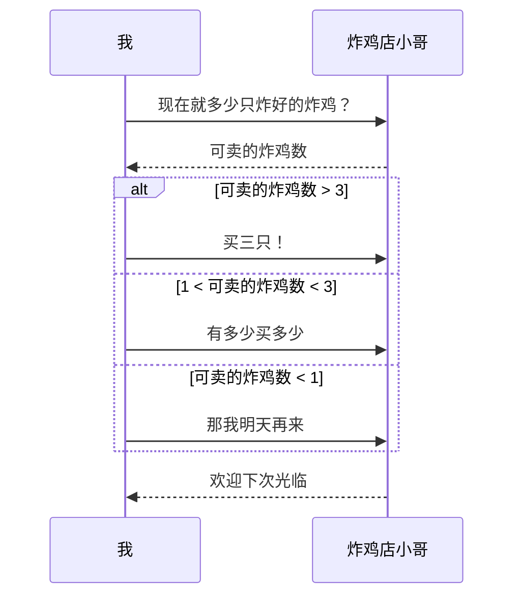

#### 可选（opt）

在某条件满足时执行消息序列，否则不执行。相当于单个分支的 if 语句。

```markdown
sequenceDiagram
    participant me as 我
    participant seller as 炸鸡店小哥
    me ->> seller : 买炸鸡
    opt 全都卖完了
        seller -->> me : 下次再来
    end
```


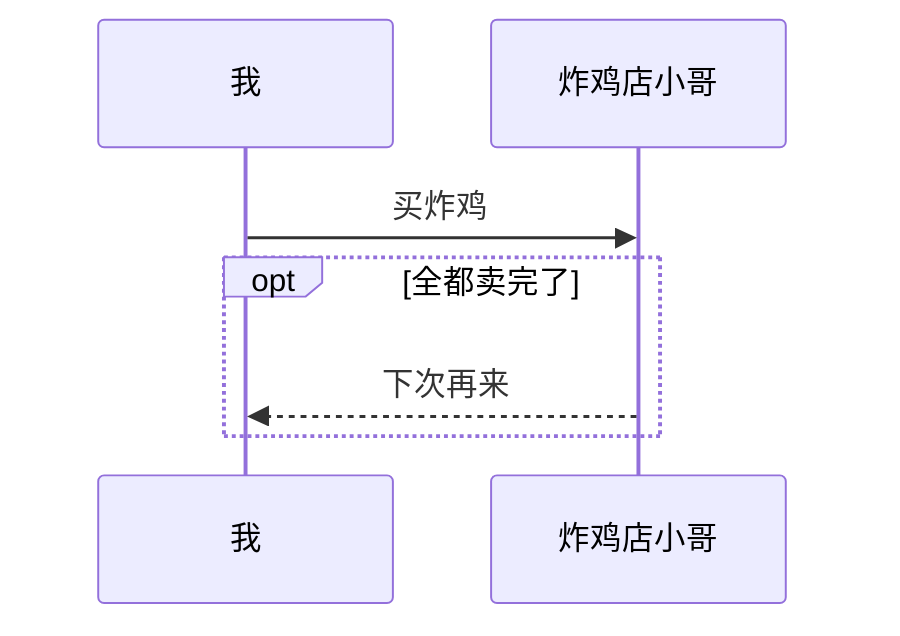

#### 并行（Par）

将消息序列分成多个片段，这些片段并行执行。

```markdown
sequenceDiagram
   participant me as 我
   participant seller as 炸鸡店小哥
   
    me ->> seller : 一个炸鸡，一杯可乐！

    par 并行执行
        seller ->> seller : 装可乐
    and
        seller ->> seller : 炸炸鸡
    end

    seller -->> me : 您的炸鸡好了！
```

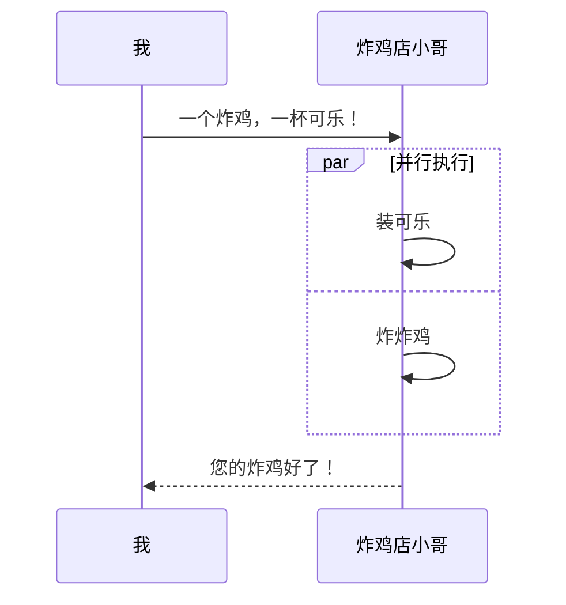


### 甘特图（gantt）

```markdown
  title 标题
	dateFormat 日期格式
	section 部分名
	任务名:参数一, 参数二, 参数三, 参数四，参数五
 
  //参数一：crit（是否重要，红框框） 或者 不填
  //参数二：done（已完成）、active（正在进行） 或者 不填(表示为待完成状态)
  //参数三：取小名 或者 不填
  //参数四：任务开始时间
  //参数五：任务结束时间
```

```
gantt
       dateFormat  YYYY-MM-DD
       title Adding GANTT diagram functionality to mermaid

       section A section
       Completed task            :done,    des1, 2014-01-06,2014-01-08
       Active task               :active,  des2, 2014-01-09, 3d
       Future task               :         des3, after des2, 5d
       Future task2              :         des4, after des3, 5d

       section Critical tasks
       Completed task in the critical line :crit, done, 2014-01-06,24h
       Implement parser and jison          :crit, done, after des1, 2d
       Create tests for parser             :crit, active, 3d
       Future task in critical line        :crit, 5d
       Create tests for renderer           :2d
       Add to mermaid                      :1d

       section Documentation
       Describe gantt syntax               :active, a1, after des1, 3d
       Add gantt diagram to demo page      :after a1  , 20h
       Add another diagram to demo page    :doc1, after a1  , 48h

       section Last section
       Describe gantt syntax               :after doc1, 3d
       Add gantt diagram to demo page      :20h
       Add another diagram to demo page    :48h
```

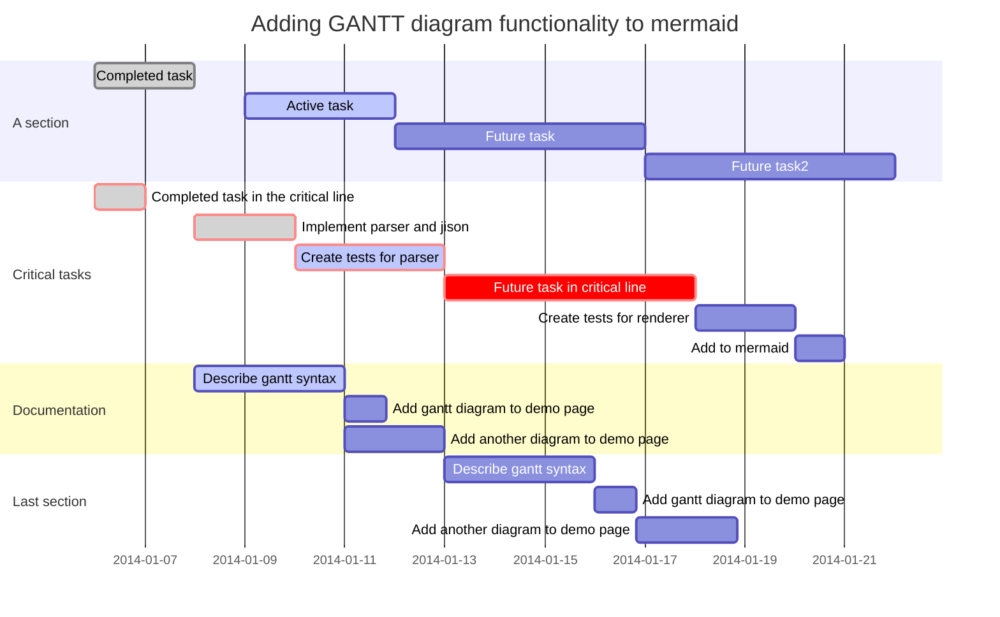


## Markdown规范

[Google Markdown Style Guide](https://github.com/google/styleguide/blob/gh-pages/docguide/style.md)

