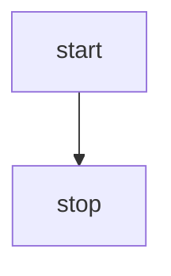
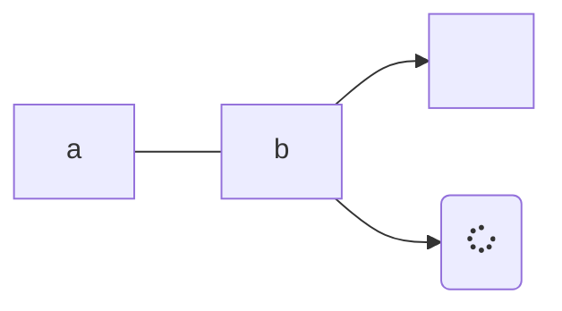
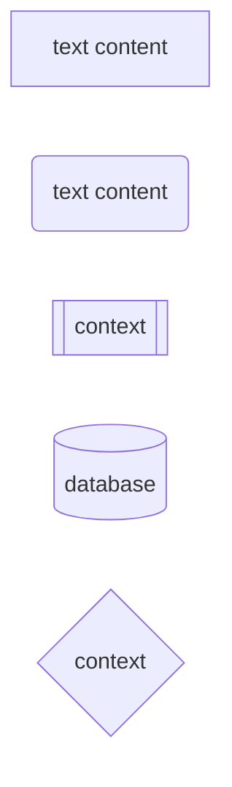
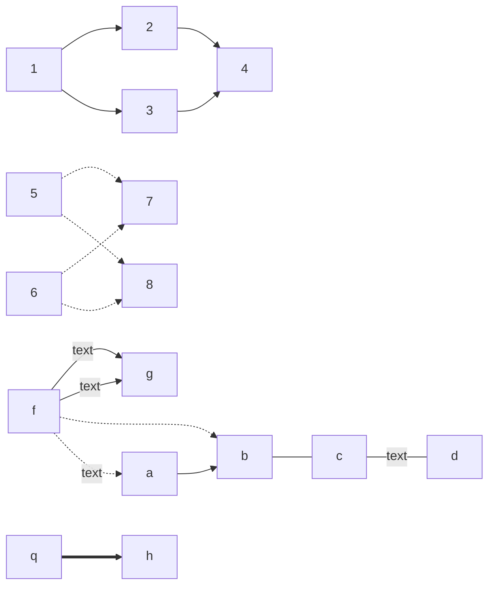

## Flowcharts

Direction: top to down

```mermaid
graph TD
start --> stop
```

left to right

```mermaid
graph LR
a --- b
b --> c[fa:fa-ban-forbidden]
b --> d(fa:fa-spinner)
```

Other deriction: TB TD BT RL

### Node

```mermaid
graph LR
node[text content]
roundNode(text content)
node3[[context]]

node4[(database)]
node5{context}
```

### link

```mermaid
graph LR
a --> b
b --- c
c -- text --- d

f -->|text| g
f -- text --> g
f -.-> b
f -. text .-> a

q ==> h

1 --> 2 & 3 --> 4

5 & 6 -.-> 7 & 8
```

