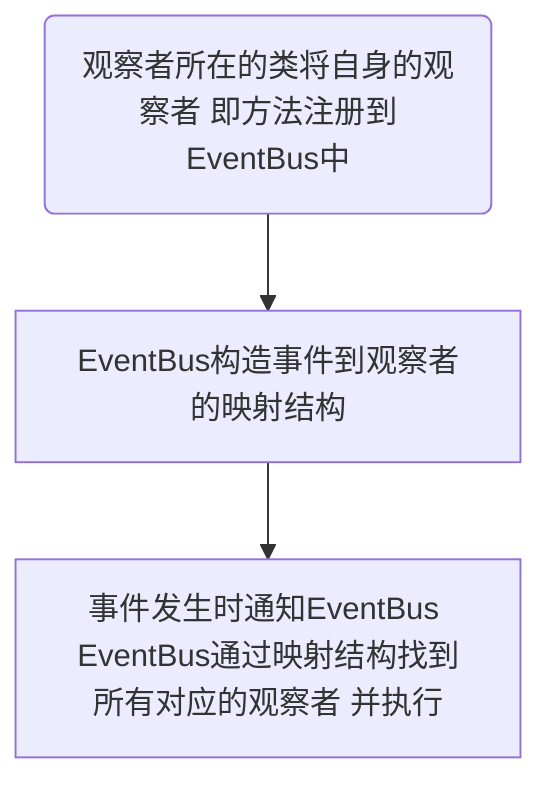
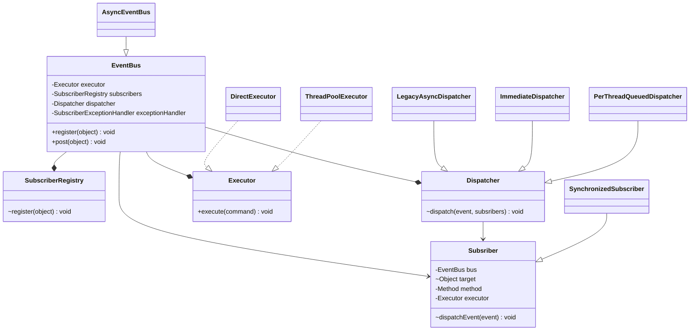

# EventBus

[TOC]

## 观察者模式

概念：

> 在对象之间定义一个一对多的依赖关系，
>
> 当一个对象（被观察者）的状态变化时，所有依赖的对象（观察者）都会自动收到通知


使用场景：

> 当一个事件发生时，会影响到很多其他模块的状态（考虑到模块可能会不断增多）


观察者模式和生产-消费模型的区别：

+ 一对多和多对多
+ 消息被多个对象消费和消息被一个对象消费


**实现方式**

- 传统方式实现观察者模式：
  1. 定义观察者接口
  2. 在被观察者中定义观察者接口的集合 
  3. 当事件发生时 被观察者遍历集合 进行通知

**缺点**：需要在被观察者中注册观察者 


优化：

- 通过一个中间映射表实现 


## Guava EventBus

实现进程内部的发布订阅模型 避免显示注册观察者 进一步解耦


### 流程图




### **类图**



**EventBus中成员变量各自的作用**

- `SubscriberRegistry` : 核心组件 维护了事件到事件的所有订阅者方法的Map 
- `Executor` ：用于定义如何调用订阅者方法
- `Dispatcher`： 控制事件分发到订阅者方法的次序
- `SubscriberExceptionHandler` : 执行订阅者方法出错时执行的逻辑


### **EventBus对象创建**

两种类型：

- 同步 

  ```java
  EventBus eventBus = new EventBus();
  // 等价于
  EventBus eventBus = new EventBus(
          // 默认标识符标识符 
    			"default",
    			// 在发布事件的线程中调用观察者方法
          MoreExecutors.directExecutor(),
    			// 每个发布事件的线程都有自己独立的队列 依次从队列中取出事件和观察者 执行通知逻辑
          Dispatcher.perThreadDispatchQueue(),
    			// 默认的异常处理：记录日志
          LoggingHandler.INSTANCE);
  ```

  

- 异步

  ```java
  EventBus eventBus = new AsyncEventBus(new ThreadPoolExecutor());
  // 等价于
  EventBus eventBus = new EventBus(
    "default", 
    // 在线程池中的线程中调用观察者方法
    new ThreadPoolExecutor(), 
    // 所有发布事件的线程共享一个队列
    Dispatcher.legacyAsync(), 
    LoggingHandler.INSTANCE);)
  ```

  

### **注册观察者**

*订阅者是一个方法而非一个类*

1. 定义一个`public`方法，单一入参，参数类型为想要接收的事件类型

2. 方法上加上`@Subscribe`注解 触发方法时默认是同步的

   （如果允许多个线程访问 如：无状态方法 还可以加上`@AllowConcurrentEvents`注解）

3. 将方法所在的类 注册到EventBus中 `register(Object)`

```java
public class Observer extends BaseObserver {

  	// 定义事件的观察者 事件类型即为所定义参数的类型
    @Subscribe
    @AllowConcurrentEvents
    public void onEvent(Integer event) {
        System.out.println("handle integer event:" + event);
    }
    
}
// 将方法所在的类 注册到EventBus
eventBus.register(new Observer());

// 实际调用注册表 
void register(Object listener) {
  	// 获取映射：事件 -> 事件对应的所有订阅者（Method对象） MultiMap中一个Key可以对应多个Value
    Multimap<Class<?>, Subscriber> listenerMethods = findAllSubscribers(listener);
		// 将映射将入到全局的Map中
    for (Entry<Class<?>, Collection<Subscriber>> entry : listenerMethods.asMap().entrySet()) {
      Class<?> eventType = entry.getKey();
      Collection<Subscriber> eventMethodsInListener = entry.getValue();
      CopyOnWriteArraySet<Subscriber> eventSubscribers = subscribers.get(eventType);
      if (eventSubscribers == null) {
        CopyOnWriteArraySet<Subscriber> newSet = new CopyOnWriteArraySet<>();
        eventSubscribers =
            MoreObjects.firstNonNull(subscribers.putIfAbsent(eventType, newSet), newSet);
      }
      eventSubscribers.addAll(eventMethodsInListener);
    }
  }

// 构建映射：事件 -> 事件对应的所有订阅者（Method对象）
private Multimap<Class<?>, Subscriber> findAllSubscribers(Object listener) {
    Multimap<Class<?>, Subscriber> methodsInListener = HashMultimap.create();
    Class<?> clazz = listener.getClass();
  	// 注解扫描
    for (Method method : getAnnotatedMethods(clazz)) {
      Class<?>[] parameterTypes = method.getParameterTypes();
      Class<?> eventType = parameterTypes[0];
      // 想想为什么需要把EventBus对象和订阅者所在的类对象也封装进去？
      // Subsriber负责调用方法 默认情况下可以保证在EventBus中调用该方法的线程安全
      methodsInListener.put(eventType, Subscriber.create(bus, listener, method));
    }
    return methodsInListener;
  }

// getAnnotatedMethods(clazz)实际执行逻辑
private static ImmutableList<Method> getAnnotatedMethodsNotCached(Class<?> clazz) {
  	// 获取该类所有的父类与接口类及其本身的Class对象
    Set<? extends Class<?>> supertypes = TypeToken.of(clazz).getTypes().rawTypes();
  	// 用于过滤重复的观察者：方法签名相同的
    Map<MethodIdentifier, Method> identifiers = Maps.newHashMap();
    for (Class<?> supertype : supertypes) {
      for (Method method : supertype.getDeclaredMethods()) {
        // 判断该方法是否存在@Subsribe注解
        if (method.isAnnotationPresent(Subscribe.class) && !method.isSynthetic()) {
          Class<?>[] parameterTypes = method.getParameterTypes();
          // ...省略参数校验：1.校验参数个数是否为一个 2.是否为对象类型
          MethodIdentifier ident = new MethodIdentifier(method);
          if (!identifiers.containsKey(ident)) {
            identifiers.put(ident, method);
          }
        }
      }
    }
  	// 返回所有观察者
    return ImmutableList.copyOf(identifiers.values());
  }

// 很重要的一个封装类：Subsriber的创建
static Subscriber create(EventBus bus, Object listener, Method method) {
  // 该方法上没有@AllowConcurrentEvents注解则默认创建同步的Subsriber 区别后面发布事件 调用方法时会说  
  return isDeclaredThreadSafe(method)
        ? new Subscriber(bus, listener, method)
        : new SynchronizedSubscriber(bus, listener, method);
  }

private static boolean isDeclaredThreadSafe(Method method) {
    return method.getAnnotation(AllowConcurrentEvents.class) != null;
  }
```


### **发布事件 通知订阅者**

1. 将事件对象放入EventBus的`post`方法中，EventBus会将该事件通知到所有注册的观察者中
2. 事件必须是一个对象 会通知所有该对象及其能接受该对象的父类/接口
3. 如果没有观察者注册接收这个事件，则会将这个事件包装成一个DeadEvent 通知DeadEvent的观察者

```java
// 发布者发布事件
for (int i = 0; i < 3; i++) {
  eventBus.post(i);
}

public void post(Object event) {
  	// 获取该类及其所有父类的Class对象对应的订阅者
    Iterator<Subscriber> eventSubscribers = subscribers.getSubscribers(event);
  	// 如果存在订阅者 则通过分发器通知对应的订阅者事件发生
    if (eventSubscribers.hasNext()) {
      // 发布事件到所有的订阅者上
      dispatcher.dispatch(event, eventSubscribers);
    } else if (!(event instanceof DeadEvent)) {
      // 找不到对应的订阅者且自身不是DeadEvent类型（程序编写错误） 
      // 封装成DeadEvent对象再次发布 所以可以注册一个观察DeadEvent的订阅者 用于定位问题
      post(new DeadEvent(this, event));
    }
}


Iterator<Subscriber> getSubscribers(Object event) {
  	// 获取该类及其所有父类的Class对象
    ImmutableSet<Class<?>> eventTypes = flattenHierarchy(event.getClass());
    List<Iterator<Subscriber>> subscriberIterators =
        Lists.newArrayListWithCapacity(eventTypes.size());
    for (Class<?> eventType : eventTypes) {
      CopyOnWriteArraySet<Subscriber> eventSubscribers = subscribers.get(eventType);
      if (eventSubscribers != null) {
        // eager no-copy snapshot
        subscriberIterators.add(eventSubscribers.iterator());
      }
    }
    return Iterators.concat(subscriberIterators.iterator());
  }


// 同步EventBus中默认使用的分发方式
private static final class PerThreadQueuedDispatcher extends Dispatcher {

    /** 线程私有的队列：存储事件对象和对应的订阅者的封装类对象 */
    private final ThreadLocal<Queue<Event>> queue；

    /** 线程私有的标志 */
    private final ThreadLocal<Boolean> dispatching；

    @Override
    void dispatch(Object event, Iterator<Subscriber> subscribers) {
      // 获取发布者线程私有的队列
      Queue<Event> queueForThread = queue.get();
      queueForThread.offer(new Event(event, subscribers));
      if (!dispatching.get()) {
        dispatching.set(true);
        try {
          Event nextEvent;
          while ((nextEvent = queueForThread.poll()) != null) {
            while (nextEvent.subscribers.hasNext()) {
              // 调用Subsriber的dispatchEvent
              nextEvent.subscribers.next().dispatchEvent(nextEvent.event);
            }
          }
        } finally {
          dispatching.remove();
          queue.remove();
        }
      }
    }
  }

// 异步EventBus中默认使用的分发方式
private static final class LegacyAsyncDispatcher extends Dispatcher {

    /** Global event queue. */
    private final ConcurrentLinkedQueue<EventWithSubscriber> queue =
        Queues.newConcurrentLinkedQueue();

    @Override
    void dispatch(Object event, Iterator<Subscriber> subscribers) {
      // 加入全局队列
      while (subscribers.hasNext()) {
        queue.add(new EventWithSubscriber(event, subscribers.next()));
      }
			// 将全局队列中的method都触发完
      EventWithSubscriber e;
      while ((e = queue.poll()) != null) {
        e.subscriber.dispatchEvent(e.event);
      }
    }
 }

class Subscriber {

  /** The event bus this subscriber belongs to. */
  @Weak private EventBus bus;

  /** The object with the subscriber method. */
  @VisibleForTesting final Object target;

  /** Subscriber method. */
  private final Method method;

  /** Executor to use for dispatching events to this subscriber. */
  private final Executor executor;
  
  final void dispatchEvent(final Object event) {
    // 模板方法 将执行订阅者方法的逻辑封装成一个Runnable匿名子类对象 让Executor执行
    executor.execute(
      new Runnable() {
        @Override
        public void run() {
          try {
       			// 具体执行
            invokeSubscriberMethod(event);
          } catch (InvocationTargetException e) {
            // 执行中出现异常 则封装异常上下文 交给SubscriberExceptionHandler处理
            bus.handleSubscriberException(e.getCause(), context(event));
          }
        }
      });
  }
  
  
  void invokeSubscriberMethod(Object event) throws InvocationTargetException {
    try {
      // 反射调用
      method.invoke(target, checkNotNull(event));
    } catch (IllegalArgumentException e) {
      throw new Error("Method rejected target/argument: " + event, e);
    } catch (IllegalAccessException e) {
      throw new Error("Method became inaccessible: " + event, e);
    } catch (InvocationTargetException e) {
      if (e.getCause() instanceof Error) {
        throw (Error) e.getCause();
      }
      throw e;
    }
  }
  
  static final class SynchronizedSubscriber extends Subscriber {
		
    // 子类会给该方法加锁 保证一次只会有一个线程执行method.invoke
    @Override
    void invokeSubscriberMethod(Object event) throws InvocationTargetException {
      synchronized (this) {
        super.invokeSubscriberMethod(event);
      }
    }
  }
} 
```


