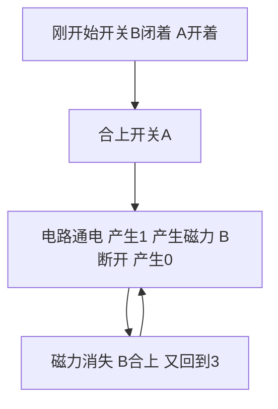

# 计算机组成原理

[TOC]


## 推荐阅读书籍

- 编码：隐匿在计算机软硬件背后的语言
- 计算机组成与设计 硬件软件接口
- CSAPP


## 计算机基本组成


### 基本硬件组成

+ CPU：负责计算

+ 内存：程序需要加载到内存中才能运行

+ 主板：CPU和内存都插在主板上

  > 主板的芯片组和总线解决了CPU和内存之间的通信问题
  >
  > 南桥芯片组：控制外部IO设备和CPU之间的通信

+ 输出设备：显示器

+ 输入设备：鼠标、键盘


### 冯诺依曼结构体系

> 又称为存储程序计算机

计算机应该由以下部分组成：

+ 处理器单元：算术逻辑单元 + 处理器寄存器
+ 控制器单元：程序计数器 + 指令寄存器
+ 存储单元：内存 + 外存（用于存储数据和指令）
+ 输入设备
+ 输出设备


### 计算机性能

性能=1/响应时间

**性能指标**

+ 响应时间：执行一个程序需要花费的时间

+ 吞吐率：一定的时间范围内计算机能处理的数据或者执行的程序指令

  可以通过增加计算机核数提高吞吐率（多核就是多个CPU放在了同一块芯片上）


程序的执行时间 = 程序CPU执行时间 + 其他时间（其他程序执行时间、IO、进程切换时间）


程序CPU执行时间 = 指令数 * 指令的平均时钟周期数 * 时钟周期时间

> 指令数：程序编译得来
>
> 时钟周期时间：计算机主频的倒数 如主频为3.2GHz 时钟周期时间为1/3.2G 超频就是提高主频 减少时钟周期时间 也会导致散热压力加大


缩短程序CPU执行时间的方法：

+ 减少程序编译后的指令数
+ 减少指令的平均时钟周期数
+ 减少时钟周期是阿金


### 计算器功耗

CPU计算得更快的方法：

+ 相同面积内多放一些晶体管：制作更小的晶体管，增加密度
+ 让晶体管打开关闭的速度更快，提升主频

这样都会造成耗电和散热的问题


功耗 = 1/2 * 负载电容 * 电压的平方 * 开关频率 * 晶体管数量


**阿姆达尔定律**：部分的优化给整体带来的速度的提升时不明显的，详见CSAPP1.9


计算机层面提高性能的几个原则性方法：

+ 并行计算
+ 加速大概率事件：缓存
+ 通过流水线提高性能
+ 通过预测提高性能


## 指令和运算

 

### 计算机指令


#### 机器码


**存储程序型计算机**：程序指令存储在存储器中的计算机


不同架构的CPU有自身的计算机指令集 `x86` `ARM`


**常见的计算机指令类型**


CPU中的寄存器：

+ PC寄存器：存放下一条需要执行的计算机指令的内存地址

  跳转指令(如`jne jle`)会修改PC寄存器里面的地址值

+ 指令寄存器：用来存放当前正在执行的指令

+ 条件码寄存器：存放CPU进行算术或者逻辑计算的结果


```shell
# 编译
gcc -g -c （-O 指示编译器优化）test.c
# 生成汇编代码
objdump -d -M intel -S test.o
```


高级语言的`if-else` `for while` 在机器指令层面都是`goto`


```c

int static add(int a, int b)
{
   0:   55                      push   rbp
   1:   48 89 e5                mov    rbp,rsp
   4:   89 7d fc                mov    DWORD PTR [rbp-0x4],edi
   7:   89 75 f8                mov    DWORD PTR [rbp-0x8],esi
    return a+b;
   a:   8b 55 fc                mov    edx,DWORD PTR [rbp-0x4]
   d:   8b 45 f8                mov    eax,DWORD PTR [rbp-0x8]
  10:   01 d0                   add    eax,edx
}
  12:   5d                      pop    rbp
  13:   c3                      ret    
0000000000000014 <main>:
int main()
{
  14:   55                      push   rbp
  15:   48 89 e5                mov    rbp,rsp
  18:   48 83 ec 10             sub    rsp,0x10
    int x = 5;
  1c:   c7 45 fc 05 00 00 00    mov    DWORD PTR [rbp-0x4],0x5
    int y = 10;
  23:   c7 45 f8 0a 00 00 00    mov    DWORD PTR [rbp-0x8],0xa
    int u = add(x, y);
  2a:   8b 55 f8                mov    edx,DWORD PTR [rbp-0x8]
  2d:   8b 45 fc                mov    eax,DWORD PTR [rbp-0x4]
  30:   89 d6                   mov    esi,edx
  32:   89 c7                   mov    edi,eax
  34:   e8 c7 ff ff ff          call   0 <add>
  39:   89 45 f4                mov    DWORD PTR [rbp-0xc],eax
  3c:   b8 00 00 00 00          mov    eax,0x0
}
  41:   c9                      leave  
  42:   c3                      ret    
```

**函数调用的过程**：

1. `call 0 <add>`：执行函数调用时，会把PC寄存器的下一条指令的地址压栈（还有其他函数的参数也压入栈中）

   add函数第0行的`push rbp`就是在进行压栈

   `rbp`: *register base pointer (start of stack)* 当前栈帧的栈底

   `rsp`: *register stack pointer (current location in stack, growing downwards)* 当前栈帧的栈顶

   两个指针组成的就是当前执行的函数对应的栈帧（可以类比滑动窗口）

2. `mov rbp, rsp` 

3. `pop rbp`：将当前的栈帧出栈

4. 更新PC寄存器的值

[汇编指令操作栈](https://manybutfinite.com/post/journey-to-the-stack/)


函数内联（inline）

> 把调用的函数产生的指令，直接插入到调用的位置，来替换对应的函数调用指令

实现方式：

+ `gcc -g -c -O test.c` 编译时加上`-O`参数
+ 定义函数时加上`inline`关键字

利弊：

+ 利：减少了CPU需要执行的指令，无需地址跳转和压栈入栈
+ 弊：没有了复用，程序占用的空间会变大


#### 程序执行


**ELF和静态链接**


C**语言编译到执行的过程**


**ELF**: *Execuatable and Linkable File Format* 可执行可链接文件格式

是Linux下的目标文件和可执行文件的文件格式

ELF的Section：

+ `.text section`：用来保存程序的代码和指令
+ `.data section`：保存程序里面设置好的初始化信息
+ `.rel.text section`：当前文件中 哪些跳转地址是不知道的（如link前main函数中引用了一个其他.o文件的函数）
+ `.symtab section`：当前文件定义的函数名字 -> 对应地址


**链接器做的工作**

1. 扫描所有目标文件 `.o`文件
2. 将所有文件中的符号表中的信息收集起来，形成一个全局的符号表
3. 根据全局的符号表的信息，把重定位表中的不确定的地址跳转的代码确定下来(保证了可执行文件里面的函数调用的地址都是正确的)
4. 最后将所有的目标文件的对应段进行合并
5. 形成可执行代码（仍然是一个ELF）


**装载器做的工作**：解析ELF文件，将对应的指令和数据加载到内存中供CPU执行


同样一个程序在Linux下可以执行，但是到Windows下不能执行的原因：

> 两个操作系统下的可执行文件的格式不一样

+ Windows: PE *portable execuatable format*
+ Linux: ELF *execuatable linkable format*


**程序装载**

装载程序到内存需要解决的两个问题：

+ 可执行程序加载后内存空间应该是连续的（执行指令的时候 依照程序计数器的指示顺序执行的（除了跳转指令外））
+ 需要同时加载很多程序，程序的内存地址空间问题


内存映射：

+ 虚拟内存地址：指令中用到的内存地址
+ 物理内存地址：实际在内存硬件中的地址


**内存分段**： *segmentation*

概念：

> 找出一段连续的物理内存跟虚拟内存进行映射的方法

弊端：

会导致**内存碎片**(*memory fragmentation*)的问题，即找不到满足条件的连续的物理内存空间

解决内存碎片的方法：

内存交换 *memory swapping* ， 将需要移动位置的分段块先写到磁盘，再从磁盘读回内存，并将其紧凑到已使用内存的附近，从而解决内存碎片的问题，但是如果交换的数据量很大，磁盘IO速度就会很慢


**内存分页** *paging*

物理内存空间和虚拟内存空间都切成一段段固定尺寸的大小 

```shell
# linux 下查看页大小
getconf PAGE_SIZE
```


+ 一个程序的物理页之间是可以不连续的（逻辑上是连续的，因为可以记录下一个页的地址），但是一个页内部的空间是连续的

+ 加载程序时，不需要一次性把程序都加载到内存中，当需要读取特定的页，但发现该页没有加载到物理内存中时，会触发CPU的缺页中断(*page fault*) （懒加载的思想）

+ 内存交换再内存紧缺时触发 给在执行中的程序腾出空间来存放页

  


**动态链接**

> 链接的目标是加载到内存中的共享库，该共享库会被很多程序的指令调用到

+ Windows: `.ddl` *dynamic-link libarary*
+ Linux: `.so` *shared object*


**静态链接**：合并代码段，这样做的弊端是相同的功能代码在内存中会存很多份


共享代码需要满足的要求：地址无关，无论加载在哪个内存地址都能正常执行，可以理解为一个无状态函数，地址用相对地址


动态链接的解决方案：

+ PLT: *procedure link table* 程序链接表

+ GOT : *global offset table* 全局偏移表，用于确定调用共享库代码(外部变量和函数)的虚拟内存地址

  因为共享库的代码部分的物理内存是共享的，但是数据部分是动态链接它的程序的每个都分配有一份，GOT表就是位于共享库里面的数据段

  


推荐阅读：

《程序员的自我修养：链接 装载和库》


### 计算机运算


#### 二进制编码

整数的两种表示方法：

+ 原码表示法：用一个数最左边的数值来表示它是正数还是负数

  3: `0011` 

  -3: `1011`

  缺点：0会有两种表达方式: `1000` `0000`

+ 补码：最高位还是符号位，但是最高位取负值

  -5: `1011`

  方便二进制整数相加 不用做特殊处理

  -5 + 1 = -4

  `  1011`

  `+0001`

  `=1100`


字符的二进制表示：

+ 字符集：字符的集合 `Unicode`就是一个字符集
+ 字符编码：字符 -> 字符的二进制表示的一个映射关系 map


推荐阅读：《编码：隐匿在计算机软硬件背后的语言》


#### 数字电路


+ 电路：用电路的开关表示1和0
+ 晶体管：导电为1 绝缘为0


继电器：不断通过新的电源重新放大之前衰减的信号

将输入端的0 1传送到输出端


用电路表示与 或 非的逻辑关系

+ 与：两个开关串联

+ 或：两个开关并联

+ 非：开关默认开启 -> 开关默认关闭

  


基本的门电路：


**半加器**： 解决个位的加法问题

+ 个位：异或门
+ 进位：与门


**全加器**：解决二位、四位等高位的加法问题

需要三个输入：

+ 加数
+ 被加数
+ 低位传递过来的进位信号

组成：

+ 半加器：计算加数和被加数（得到异或结果和与结果）
+ 半加器：计算加数和被加数的和（异或结果）
+ 或门：对两个半加器的进位进行或操作


8位数的运算：用8个全加器串联起来 形成一个加法器


整数计算溢出标志：负责最高位运算的全加器的溢出位为1


组成:

> 门电路
>
> > 半加器
> >
> > > 全加器
> > >
> > > > 加法器
> > > >
> > > > > ALU


**乘法器**


**顺序乘法的实现**：

比如 `1101` * `1001` 13 \* 9


1同所有值进行与运算（复制被乘数即可） 或者是0同所有值进行与运算（输出全部为0）


> 用一个开关决定输出的是复制结果 还是全部是0


位移：对应的线路错位连接


只用一组开关来进行乘法计算：复用空间 节约了电路 但是慢（时间换空间）

我们先拿乘数最右侧的个位乘以被乘数，然后把结果写入用来存放计算结果的开关里面，然后，把被乘数左移一位，把乘数右移一位，仍然用乘数去乘以被乘数，然后把结果加到刚才的结果上。反复重复这一步骤，直到不能再左移和右移位置。这样，乘数和被乘数就像两列相向而驶的列车


乘法 -> 位移 + 加法

时间复杂度分析：顺序乘法没有办法并行 因为这次计算要依赖于上一次计算的结果

1. 4位数（4bit）的乘法运算就需要4次的（位移 + 加法）运算
2. 32 64位数的乘法运算就需要32 64次的运算
3. 所以时间复杂度是O(n)


**并行乘法运算**：空间换时间 时间复杂度为O(logn) 空间复杂度为O(n) 32位的乘法运算需要16个存储的地方


**电路并行**

门延迟：比如加法器由全加器组成，每个全加器需要等待上一个全加器的计算结果，这个等待时间就是一层门延迟


电路并行原理：将进位部分的电路完全展开，让高位的进位和计算结果和地位的计算结果可以同时获得，展开之后就能将原来需要较少但是有多层前后计算依赖关系的门电路(RISC)，展开成较多的但是依赖关系少的门电路(CISC)（电路复杂了 晶体管变多了 拿到更低的门延迟 更少的时钟周期完成一个计算指令）


**小数的表示：定点数和浮点数**

问题：怎么用32/64bit表示尽可能多的实数


 **定点数**

实现：

用4bit表示0-9 `0000-1001`，那么32bit就能表示8个9，后两位表示小数，那这样最多就能表示999999.99(BCD *binary-coded decimal*) 常用于超市这种记录小额金额的场景


缺点：

+ 浪费字节 32bit原来可以表示40亿个数 现在只能表示1亿个数
+ 不能同时表示很大的数和很小的数


**浮点数**

现实中我们用科学计数法来表示很大的树和很小的数，计算机中也一样


float可以分为3个部分

+ `s`：1bit 用于表示符号位

+ `e`: 8bit  用于表示指数位 取值范围为 [-126, 127] 用1-254映射 0和255用作标记位

  标记0 0.f 无穷大 无穷小 NAN

+ `f`： 23bit 有效位数

float = (-1)^s \* 1.f x 2^e


**浮点数的二进制转化**：

9.1

整数部分： 1001

小数部分:0.1

小数换算成二进制的的步骤：

```java
int n = 0.1;
StringBuilder bit = "";
while (true) {
		n *= 2;
  	if (n > 1) {
      bit.append(1);
    	n -= 1;
    } else {
      bit.append(0);
    }
}
```

0.1 -> 1001.000110011... -> 1.00100100110011.. × 2^3

s = 0

f = 00100100110011...

e = 3（是阶码 = 移码 - 1  移码 = 补码符号位取反）

3：

1. 补码 `00000011`
2. 移码 `10000011`
3. 阶码 `10000010`


==浮点数加法和精度损失==

浮点数加法原理

> 先对齐 再计算
>
> 先将较小的指数位统一到较大的 然后有效位右移相应的位数 然后再相加

精度损失

> 因为有个数的有效位需要右移，这会损失右边的有效位 有效位最多只有23个 float类型的，如果右移>=24位 那么所有有效位就丢失了
>
> 所以两个float类型的数相加 相差超过2^24 1600万倍 两个数相加后结果不会变


```java
float sum = 0.0f;
for (int i = 0; i < 20_000_000; i++) {
    sum += 1.0f;
}
System.out.println(sum); // 1.6777216E7
```


`Kahan Summation`算法

原理：

> 在每次计算中用减法将损失的精度存储下来 在后面的运算中再将这个损失加回去

```java
float res = 0.0f;
float remain = 0.0f;
for (int i = 0; i < 20000000; i++) {
  float cur = 1.0f;
  // 加上之前记录的损失的值
  float needToAdd = cur + remain;
  float nextRes = res + needToAdd;
  // 记录加法中损失的值
  remain = needToAdd - (nextRes - res);
  if (remain > 0) {
    remain = remain;
  }
  res = nextRes;
}
System.out.println(res); //20000000
```


## 处理器


### 建立数据通路

**计算机执行指令的过程** （指令周期）

1. Fetch获取指令

   从PC寄存器中找到对应的指令地址，根据内存地址从内存中加载指令到指令寄存器，然后PC寄存器自增

2. Decode指令译码

   根据指令寄存器中的指令，解析成具体的操作

3. Execute执行指令

   实际运行具体的指令

4. 重复1-3


**指令周期中涉及的组件**

- 存储器：存储需要执行的指令与指令执行的结果
- 控制器：通过PC寄存器和指令寄存器取出指令过程、指令的解码、无条件的地址跳转 重复执行fetch-decode-execute中的前两个步骤 产生控制信号交给ALU处理
- 运算器：指令的执行阶段


几个周期：

- 时钟周期
- CPU周期：从内存中读取一条指令的最短时间
- 指令周期


**建立数据通路**：通过数据总线的方式，将ALU和寄存器连接起来，就可以完成数据的存储、处理、传输了

> 数据通路：就是处理器单元，由操作原件(ALU)和存储原件(寄存器)构成


**CPU所需的硬件电路**

- ALU：无状态的 根据输入得出输出的电路
- 寄存器：能够进行状态读写的电路
- ”自动“的电路：按照固定地周期 不停实现PC寄存器自增 自动执行`fetch-decode-execute`
- 译码的电路：decode指令，根据拿到的内存地址去内存中取数据和指令


**组合逻辑电路**

> 固定的输入得到固定的输出


**时序逻辑电路**能解决的问题

- 可自动运行
- 可存储
- 使不同的事件按照顺序发生


**时钟信号的硬件实现**


不断产生01信号的步骤



等于将电路的输出信号再作为输入信号，是一种反馈电路

反相器：


| NOR（或非） | 0    | 1    |
| ----------- | ---- | ---- |
| 0           | 1    | 0    |
| 1           | 0    | 0    |


**RS触发器**


- 接通R，输出变为1 再断开R 输出仍为1
- 再接通S 输出变为0 再断开S 输出仍为0

> 结论：两个开关都断开的时候 最终的输出结果 取决于之前动作的输出结果（记忆功能）


**D型触发器**

控制1bit的读写


组成：

- 反相器
- 时钟信号
- 两个与门
- 两个或非门

