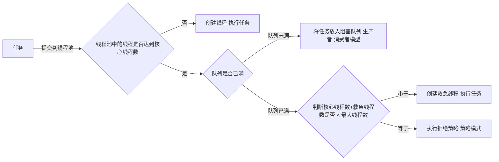

### 线程池

```java
public static ExecutorService newCachedThreadPool() {
  	// 核心线程数：0 说明都是救急线程
  	// 线程总数：
  	// 救急线程回收时间 如果60秒没有从队列获取到任务 就死亡
  	// 转交队列：实际上没有队列 消费者在生产者生产之前会一直阻塞（尝试获取）
    return new ThreadPoolExecutor(0, Integer.MAX_VALUE,
                                  60L, TimeUnit.SECONDS,
                                  new SynchronousQueue<Runnable>());
}


public static ExecutorService newFixedThreadPool(int nThreads) {
  		// 核心线程数与线程总上限一样 说明没有救急线程（所以救急线程的等待时间也就无所谓）
  		// 当核心线程数达到上限 任务都会被放到无界队列中（容量为Integer.MAX_VALUE）
        return new ThreadPoolExecutor(nThreads, nThreads,
                                      0L, TimeUnit.MILLISECONDS,
                                      new LinkedBlockingQueue<Runnable>());
    }


public static ExecutorService newSingleThreadExecutor() {
  		// 返回一个包装类 是因为不想暴露ThreadPoolExecutor中设置线程数的一些方法
  		// 只有一个核心线程 所以能保证线程的顺序执行 且某个任务发生异常不会影响后面的任务
        return new FinalizableDelegatedExecutorService
            (new ThreadPoolExecutor(1, 1,
                                    0L, TimeUnit.MILLISECONDS,
                                    new LinkedBlockingQueue<Runnable>()));
    }
```



### Volatile 

易变的 可以修饰成员变量和静态成员变量（局部变量是线程私有的 没有线程共享）

```java
package com.concurrent;

public class VolatileTest {

    private volatile static boolean stop;
    
    private static int sum;

    public static void main(String[] args) {
        new Thread(() -> {
            while (!stop) {
                //
            }
            System.out.println(Thread.currentThread() + "线程结束");
        }).start();

        try {
            Thread.sleep(1000);
        } catch (InterruptedException e) {
            e.printStackTrace();
        }
        stop = true;
        System.out.println("设置stop=true");

    }
    
    public void write() {
        sum++;
        stop = true;
        // 写屏障：在写屏障之前 所有对共享变量的改动 都会写入到主内存中 且写屏障之前的指令不会在写屏障之后执行
    }
    
    public void read() {
        // 读屏障： 在读屏障之后 所有对共享变量的读取 都要从主内存中读 且读屏障之后的指令不会在读屏障之前执行
        if (!stop) {
            int read = sum;
        }
    }
}
```


**注意：**

+ volatile只能保证读到最新的数据 并不能解决线程安全问题（没法保证原子性）
+ volatile的有序性只是在某个线程内的指令有序


